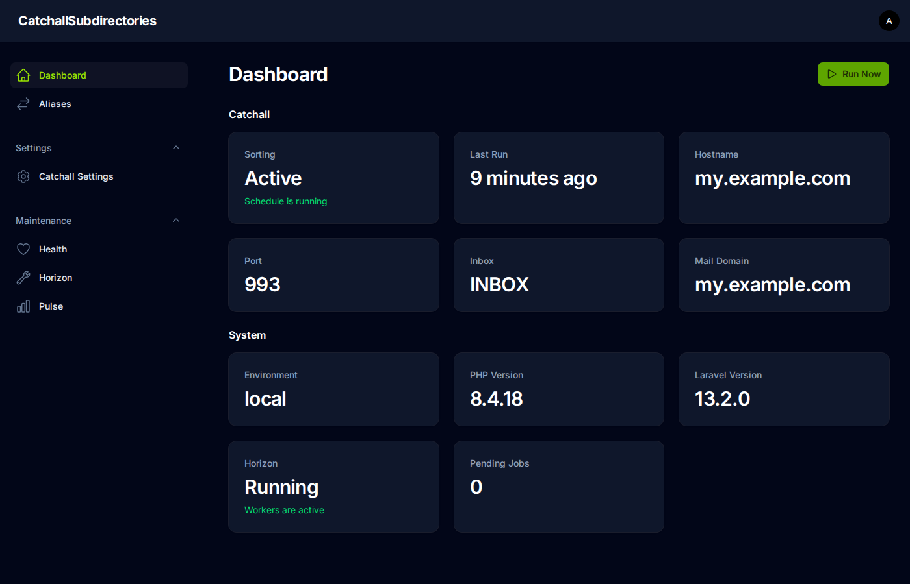
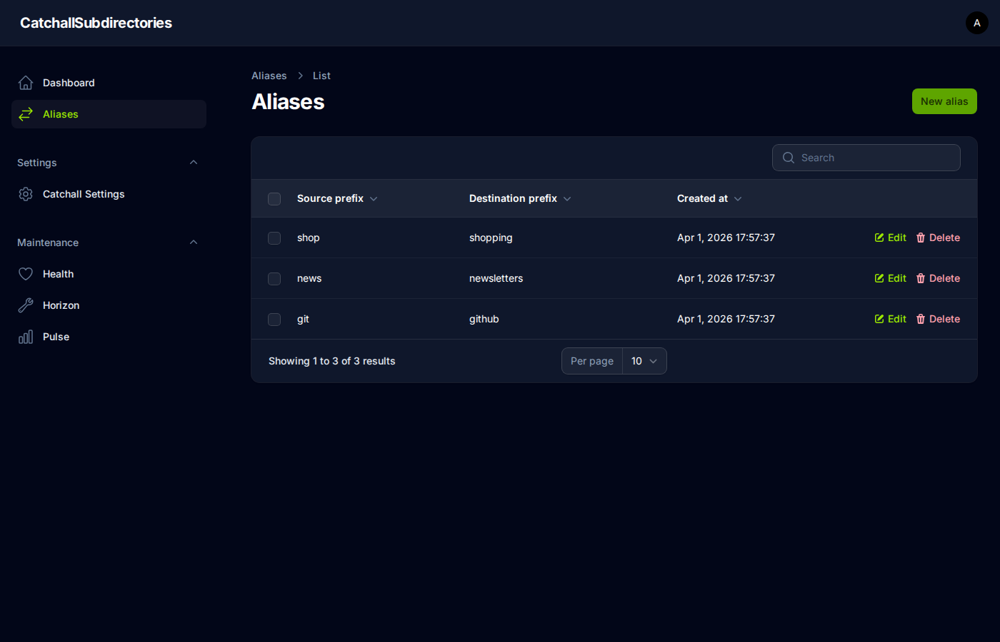
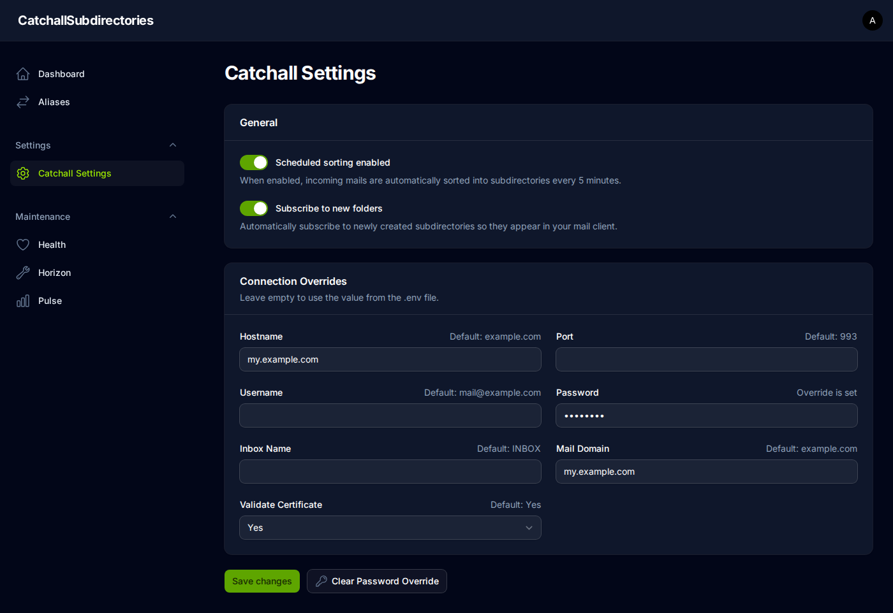

# Catch-All Subdirectories

[](https://github.com/michiruf/CatchallSubdirectories/actions/workflows/run-tests.yml)
[](https://github.com/michiruf/CatchallSubdirectories/actions/workflows/publish-docker-images.yml)

Automatically sort catch-all emails on an SMTP server into IMAP subdirectories.

When a catch-all mailbox receives an email addressed to e.g. `newsletter@example.com`, the app extracts the `newsletter`
prefix and moves the email into a matching IMAP folder (created on-demand). Aliases can optionally remap a prefix to a
different folder name. This keeps a single catch-all inbox organized without creating individual mailboxes.

## How It Works

1. A scheduled job runs every 5 minutes (or on-demand via CLI).
2. For each email in the inbox, the prefix (local part before `@`) of the destination address is extracted and used as
   the subdirectory name.
3. If an alias exists for that prefix, its destination name is used instead.
4. The email is moved into the subdirectory (created on-demand).

## Running the App

This is a standard Laravel application. Deploy it however you normally run Laravel (PHP + MySQL + Redis). Pre-built
Docker images are also available if you prefer a containerized setup. See the [Docker](#docker) section for details.

## Configuration

Copy [`.env.example`](.env.example) and configure:

| Variable                      | Description                                                       |
|-------------------------------|-------------------------------------------------------------------|
| `CATCHALL_HOSTNAME`           | IMAP server host                                                  |
| `CATCHALL_PORT`               | IMAP port (default: 993)                                          |
| `CATCHALL_USERNAME`           | Mailbox username                                                  |
| `CATCHALL_PASSWORD`           | Mailbox password                                                  |
| `CATCHALL_VALIDATE_CERT`      | Validate SSL certificate                                          |
| `CATCHALL_INBOX_NAME`         | Source inbox folder                                               |
| `CATCHALL_MAIL_DOMAIN`        | Domain to match (e.g. `example.com`)                              |
| `APP_FORCE_HTTPS`             | Force HTTPS (defaults to true in production)                      |
| `APP_SIMPLE_GATES`            | Allow access to Horizon/Pulse/Telescope via `?ok` query parameter |
| `APP_SINGLE_USER_MODE`        | Skip user management, use a single shared login                   |
| `APP_SINGLE_USER_PASSWORD`    | Password when single-user mode is enabled                         |
| `SENTRY_LARAVEL_DSN`          | Sentry DSN for error tracking                                     |
| `SENTRY_TRACES_SAMPLE_RATE`   | Sentry performance tracing sample rate                            |
| `SENTRY_PROFILES_SAMPLE_RATE` | Sentry profiling sample rate                                      |

Redis is required for queues, cache, and sessions.

## CLI Commands

| Command                        | Description                                   |
|--------------------------------|-----------------------------------------------|
| `app:catch-all-subdirectories` | Process inbox and sort emails (sync or async) |
| `app:undo-subdirectories`      | Move emails back to the inbox                 |
| `app:print-directory-summary`  | Show directory tree with mail counts          |
| `app:monitor-metrics`          | Report metrics to Sentry                      |

## Docker

Two image variants are published to `ghcr.io`:

- **Autopull** (`ghcr.io/michiruf/laravel`): pulls code from git on a schedule, runs migrations automatically.
- **Baked** (`ghcr.io/michiruf/catchall-subdirectories`): application is pre-built into the image.

Environment variables prefixed with `LARAVEL_` are written into the `.env` file at container startup with the prefix
stripped. For example, `LARAVEL_APP_DEBUG=false` becomes `APP_DEBUG=false`. This avoids collisions between Docker and
Laravel environment variables.

<details>
<summary>Example docker-compose.yml</summary>

```yaml
services:
  app:
    container_name: catchall_app
    image: ghcr.io/michiruf/catchall-subdirectories:baked-latest
    expose:
      - '80'
    environment:
      # Laravel standard env
      - LARAVEL_APP_NAME=CatchAllSubdirectories
      - LARAVEL_APP_ENV=production
      - LARAVEL_APP_KEY=base64:your-key-here
      - LARAVEL_APP_DEBUG=false
      - LARAVEL_APP_TIMEZONE=UTC
      - LARAVEL_APP_URL=https://catchall.example.com
      - LARAVEL_APP_LOCALE=en
      - LARAVEL_APP_FALLBACK_LOCALE=en
      - LARAVEL_APP_FAKER_LOCALE=en_US
      - LARAVEL_APP_MAINTENANCE_DRIVER=file
      - LARAVEL_APP_MAINTENANCE_STORE=database
      - LARAVEL_BCRYPT_ROUNDS=12
      - LARAVEL_LOG_CHANNEL=stack
      - LARAVEL_LOG_STACK=single
      - LARAVEL_LOG_DEPRECATIONS_CHANNEL=null
      - LARAVEL_LOG_LEVEL=debug
      - LARAVEL_DB_CONNECTION=mysql
      - LARAVEL_DB_HOST=mysql
      - LARAVEL_DB_PORT=3306
      - LARAVEL_DB_DATABASE=${MYSQL_DATABASE}
      - LARAVEL_DB_USERNAME=${MYSQL_USER}
      - LARAVEL_DB_PASSWORD=${MYSQL_PASSWORD}
      - LARAVEL_SESSION_DRIVER=redis
      - LARAVEL_SESSION_LIFETIME=120
      - LARAVEL_SESSION_ENCRYPT=false
      - LARAVEL_SESSION_PATH=/
      - LARAVEL_SESSION_DOMAIN=null
      - LARAVEL_BROADCAST_CONNECTION=log
      - LARAVEL_FILESYSTEM_DISK=local
      - LARAVEL_QUEUE_CONNECTION=redis
      - LARAVEL_CACHE_STORE=redis
      - LARAVEL_CACHE_PREFIX=
      - LARAVEL_MEMCACHED_HOST=127.0.0.1
      - LARAVEL_REDIS_CLIENT=phpredis
      - LARAVEL_REDIS_HOST=redis
      - LARAVEL_REDIS_PASSWORD=null
      - LARAVEL_REDIS_PORT=6379
      - LARAVEL_MAIL_MAILER=log
      - LARAVEL_MAIL_HOST=127.0.0.1
      - LARAVEL_MAIL_PORT=2525
      - LARAVEL_MAIL_USERNAME=null
      - LARAVEL_MAIL_PASSWORD=null
      - LARAVEL_MAIL_ENCRYPTION=null
      - LARAVEL_MAIL_FROM_ADDRESS="hello@example.com"
      - LARAVEL_MAIL_FROM_NAME="CatchAllSubdirectories"
      - LARAVEL_AWS_ACCESS_KEY_ID=
      - LARAVEL_AWS_SECRET_ACCESS_KEY=
      - LARAVEL_AWS_DEFAULT_REGION=us-east-1
      - LARAVEL_AWS_BUCKET=
      - LARAVEL_AWS_USE_PATH_STYLE_ENDPOINT=false
      - LARAVEL_VITE_APP_NAME="CatchAllSubdirectories"

      # App settings
      - LARAVEL_APP_FORCE_HTTPS=true
      - LARAVEL_APP_SIMPLE_GATES=true
      - LARAVEL_APP_SINGLE_USER_MODE=false
      - LARAVEL_APP_SINGLE_USER_PASSWORD=

      # Monitoring
      - LARAVEL_SENTRY_LARAVEL_DSN=https://your-sentry-dsn
      - LARAVEL_SENTRY_TRACES_SAMPLE_RATE=1.0
      - LARAVEL_SENTRY_PROFILES_SAMPLE_RATE=1.0

      # Catchall
      - LARAVEL_CATCHALL_HOSTNAME=mail.example.com
      - LARAVEL_CATCHALL_PORT=993
      - LARAVEL_CATCHALL_USERNAME=${MAIL_USER}
      - LARAVEL_CATCHALL_PASSWORD=${MAIL_PASSWORD}
      - LARAVEL_CATCHALL_VALIDATE_CERT=true
      - LARAVEL_CATCHALL_INBOX_NAME=INBOX
      - LARAVEL_CATCHALL_MAIL_DOMAIN=example.com
    volumes:
      - '/etc/timezone:/etc/timezone:ro'
    links:
      - mysql
      - redis
    networks:
      - default
      - ssl
    tty: true
    restart: unless-stopped

  mysql:
    container_name: catchall_mysql
    image: mysql:5.7
    environment:
      - MYSQL_ROOT_PASSWORD=${MYSQL_ROOT_PASSWORD}
      - MYSQL_DATABASE=${MYSQL_DATABASE}
      - MYSQL_USER=${MYSQL_USER}
      - MYSQL_PASSWORD=${MYSQL_PASSWORD}
    volumes:
      - '../DATA/mail-catchall-subdirectories/mysql/:/var/lib/mysql/'
      - '/etc/timezone:/etc/timezone:ro'
    tty: true
    restart: unless-stopped

  redis:
    container_name: catchall_redis
    image: redis:alpine
    volumes:
      - '../DATA/mail-catchall-subdirectories/redis/:/data/'
      - '/etc/timezone:/etc/timezone:ro'
    # command: redis-server --save 20 1 --loglevel warning --requirepass $PASSWORD
    tty: true
    restart: unless-stopped

networks:
  ssl:
    external: true
```

</details>

## Admin Panel

Accessible at `/admin`. Provides:

- Dashboard with system status, catchall overview, and on-demand sorting
- Alias management (optionally remap a prefix to a different folder)
- Catchall settings with overridable connection parameters
- User management (or single-user mode)
- Horizon queue dashboard
- Pulse metrics and health checks






